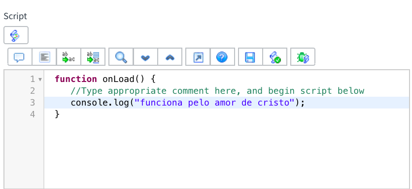
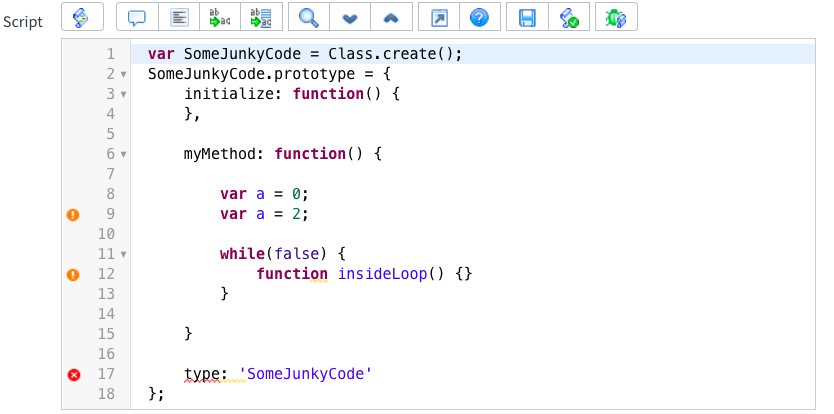
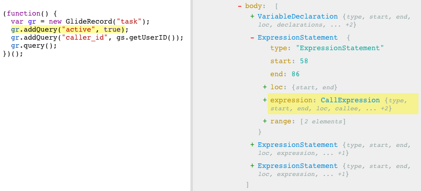
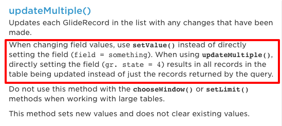
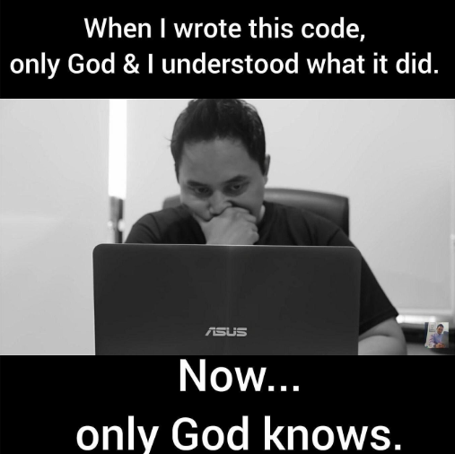
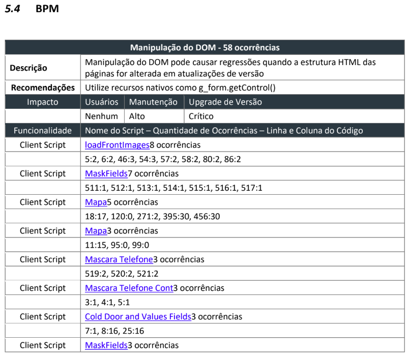
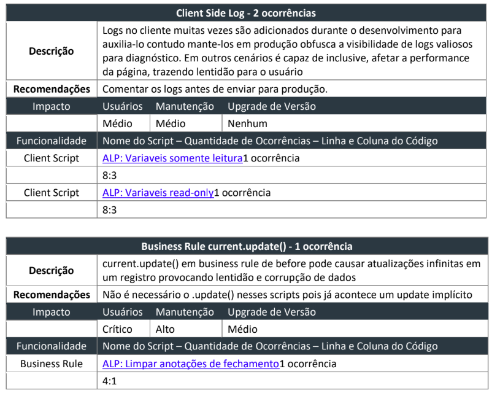
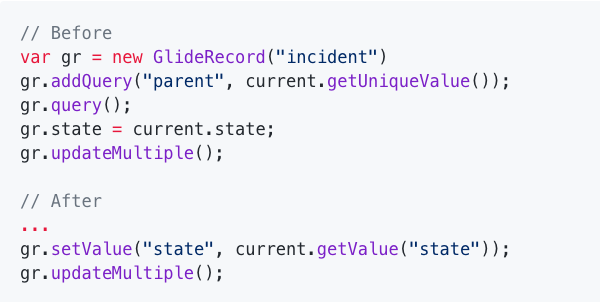

---?image=imgs/logo.png&size=contain

---

## ServiceNow

### Em busca da perfeição

---

## Objetivos

@ul
- Provocações sobre qualidade
- Apresentar uma solução
- Explorar suas dificuldades e recompensas
@ulend

---

- Como garantir a qualidade ?

+++

 > "If you can't measure it, you can't improve it."

+++

- Como garantir a qualidade ?
- Como analisar ?

+++

- Como garantir a qualidade ?
- Como analisar ?
- Escalabilidade ?

---

## Automated Configuration Review

+++

## Requerimentos

@ul
- Análise remota
- Livre de erros
- Output human friendly
@ulend

+++

## Diagnósticos

@ul
- Scripting
- Configuration
- Seguraça
- Performance
- User Experience
@ulend

---

### Impacto

- Usuários
- Administração
- Upgrade de Versão

---

### Client Side Log



+++

```javascript

// console.log() 
// comentários não podem acusar falso positivo!

```

+++

#### Ciência de Compiladores

+++



+++

#### Análise Sintática



---

### GlideRecord Property Assignment

+++

```javascript

gr.state = 4;            // Bugs obscuros e obscenos
gr.setValue("state", 4); // Se comporta como esperado

```

+++

```javascript

// Atualiza o state de todos os registros da tabela
gr.state = 4;      
gr.updateMultiple();

```

+++



---

### DOM Manipulation

+++?image=imgs/dom-manipulation.gif

---

### Before Business Rule with `current.update()`

+++

```javascript
var gr = current;
gr.update();
```

---

### ACL with database query

---

### Complex code without comments

+++



---

## Exemplos

+++



+++



---

## Roadmap

+++

@ul
- Forms 
- Lists 
- Traduções
- Consistência de dados
- Diferenças entre ambientes
- Browser performance benchmark
@ulend

Note:

- Ui policy X Form view
- Client Script X UI Policy
- Diferença entre form layouts

+++

@ul
- Diagnósticos programados
- Treinamentos associados
- Dashboard interativa
@ulend

+++

### Correção automática 🚀

+++


+++



---

## Considerações finais

+++

> “Any fool can write code that a computer can understand. Good programmers write code that humans can understand.”
> ― Martin Fowler

+++

#### Code is the easy part

+++

> “The most important property of a program is whether it accomplishes the intention of its user.”
> ― C.A.R. Hoare

---

# Obrigado!

+++

# DOMINAção mundial 💪 🌎

